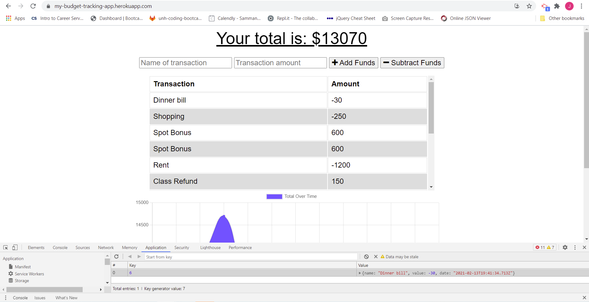
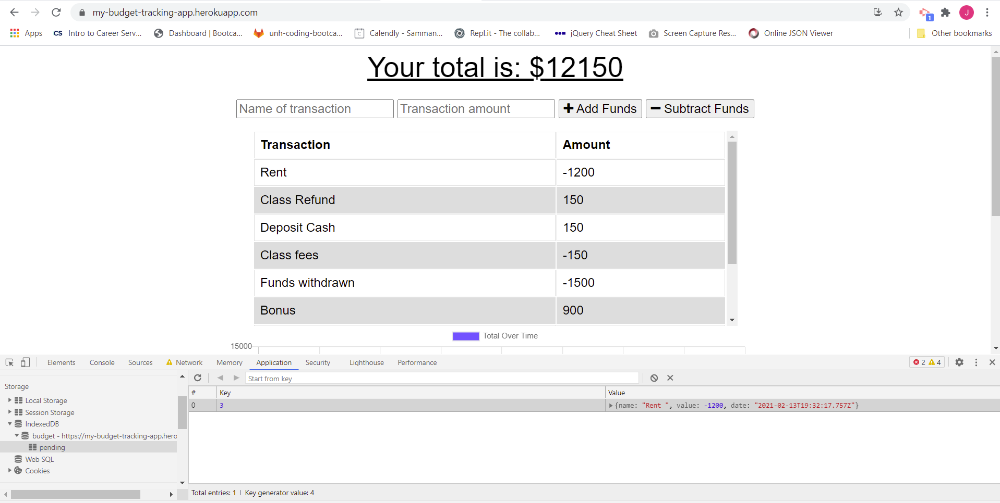

# budget-tracker
This budget tracker is a Progressive Web Application that allows for offline access and functionality 
[](https://opensource.org/licenses/MIT)

## User Story
```
AS AN avid traveller
I WANT to be able to track my withdrawals and deposits with or without a data/internet connection
SO THAT my account balance is accurate when I am traveling
```
## Description

Giving users a fast and easy way to track their money is important, but allowing them to access that information anytime is even more important. This application provides an ability for the user to have offline access to the functionality that will stil keep a track of their overall budget.The user will be able to add expenses and deposits to their budget with or without a connection. While being able to enter transactions offline, the correct total will get populated when the user is back online.
GIVEN a user is on Budget App without an internet connection, WHEN the user inputs a withdrawal or deposit
THEN that will be shown on the page, and added to their transaction history when their connection is back online.

Offline Functionality:
  * Enter deposits offline
  * Enter expenses offline

When brought back online:
  * Offline entries should be added to tracker.

## Table of Contents
* [Installation](#installation)
* [Usage](#usage)
* [Contributing](#contributing)
* [Questions](#questions)
* [License](#license)

## Installation
1. Pre-requirement is to install a command-line application and node version 14.15.0 or higher.
2. Open the terminal/command-line and open the directory where the project is downloaded. 
3. Enter the command 'npm install' to install all the required package dependencies.

## Usage
1. In the command line/terminal within the directory that the project is downloaded, invoke the application using the command 'node server.js' or' npm start' 
2. The application can be accessed using this URL in the browser (https://my-budget-tracking-app.herokuapp.com/). The Home page of the budget-tracker application will be rendered, with 2 input boxes and 2 buttons
  - The 1st input box can be used to name the transaction
  - The 2nd input box takes in the amount 
Depending on whether the transaction is a deposit or a withdrawal, the "Add Funds" and "Subtract Funds" buttons are to be used
3. When there is no internet connection, any transaction entry made will still be recorded and will appear in the table below. The total will also get updated accordingly. When back online, the total reflects accurately after considering the transactions that were entered offline.
4. The page also has a graph that displays the total over time. 

## Contributing
This application has been individually developed by Jesal Mehta. If you are interested in fixing issues and contributing directly to the code base, you can do so according to the guidelines listed in the [Contributor Covenant](https://www.contributor-covenant.org/) industry standard.

## Questions
For any questions,
Here is my Github profile link: [JesalDM](https://github.com/JesalDM)  
You can also reach out to me directly at [jesaldmehta@gmail.com](mailto:jesaldmehta@gmail.com)

## License
This project is licensed under the terms of the MIT license.

## For Review
* Github Repository URL: https://github.com/JesalDM/budget-tracker
* Deployed application Heroku URL: https://my-budget-tracking-app.herokuapp.com/
* Application demo: 
* Screenshot :
      - 
      - 
